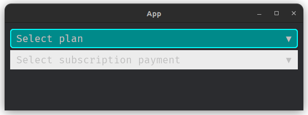

# FaSelection

```
🟡 Needs container
🟡 Doesn't accepts child/children
```

### Variants
```rust
pub enum SelectorVariant {
    Outlined,
    Default,
    Underlined,
}
```

### Sizes
```rust
pub enum SelectionSize {
    Small,
    Normal,
    Large,
}
```

### Resource
Resource to store key value pair of selector id & selected choice.
```rust
pub struct SelectedChoicesResource {
    pub choices: HashMap<String, String>
}

impl SelectedChoicesResource {
    pub fn update_or_insert(&mut self, id: String, selected_choice: String) {
        // ..
    }
}
```

### API
```rust
pub fn fa_selection(
    &mut self,
    id: &str,
    placeholder: &str,
    choices: &Vec<String>,
    label: &str,
    variant: &str,
    size: &str,
) -> Entity {
    // ..
}
```

### Usage via builder
```rust
let selection = builder.fa_selection(..);
```
Return `Entity` of the widget which must be used as child of `FaContainer` widget.

### Example
```rust
let plans = builder.fa_selection(
    "#plans",
    "Select plan",
    &vec!["Personal".to_string(), "Team".to_string(), "Enterprise".to_string()],
    "",
    "",
    ""
);

builder.fa_container("#container", &vec![plans]);
```


### Getting selected choice
The selected choice of a selection can be read from `SelectedItemsResource` within system.

```rust
fn my_system(selected_items: Res<SelectedItemsResource>) {
    if let Some(selected_choice) = selected_items.items.get("#my-selection-id") {
        println!("Choice: {:?}", selected_choice);
    }
}
```
