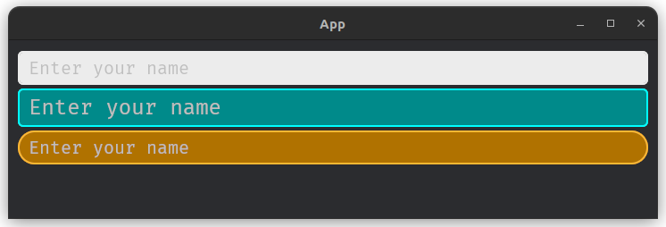

# FaTextInput

```
🟡 Needs container
🟡 Doesn't accept child/children
```

### Variants
```rust
pub enum TextInputVariant {
    Default,
    Outlined,
    Underlined,
}
```

### Sizes
```rust
pub enum TextInputSize {
    Small,
    Normal,
    Large,
}
```

### Resource
Resource to store key value pair of text-input id & its data.
```rust
pub struct FaTextInputResource {
    pub inputs: HashMap<String, String>,
}

impl FaTextInputResource {
    pub fn update_or_insert(&mut self, id: String, new_value: String) {
        // ..
    }
}
```

### API
```rust
pub fn fa_text_input(
    &mut self,
    id: &str,
    placeholder: &str,
    variant: &str,
    size: &str,
) -> Entity {
    // ..
}
```

### Usage via builder
```rust
let input = builder.fa_text_input(..);
```
Return `Entity` of the widget which must be used as child of `FaContainer` widget.

### Example
```rust
let input = builder.fa_text_input("#input", "Enter your name", "", "");

builder.fa_container("#container", &vec![input]);
```


### Getting input data
The input data can be read from `FaTextInputResource` within system.

```rust
fn my_system(input_resource: Res<FaTextInputResource>) {
    if let Some(data) = input_resource.inputs.get("#my-text-input-id") {
        println!("Data: {:?}", data);
    }
}
```
